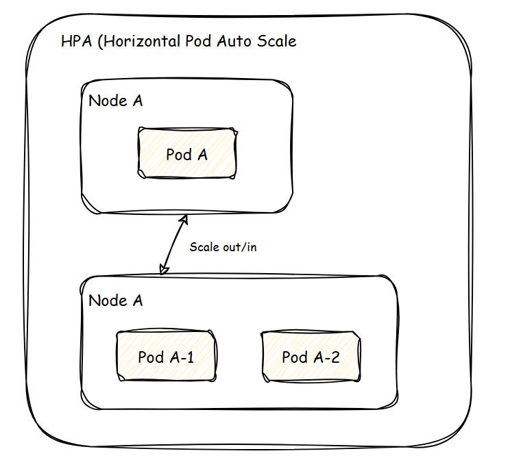
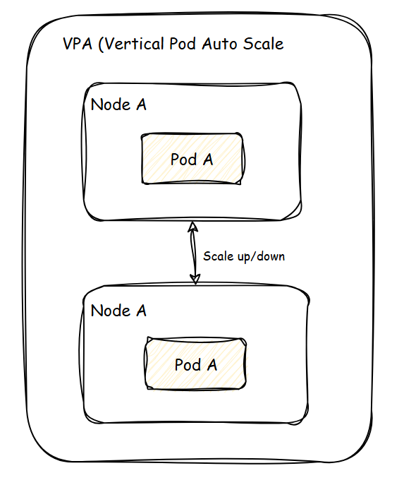
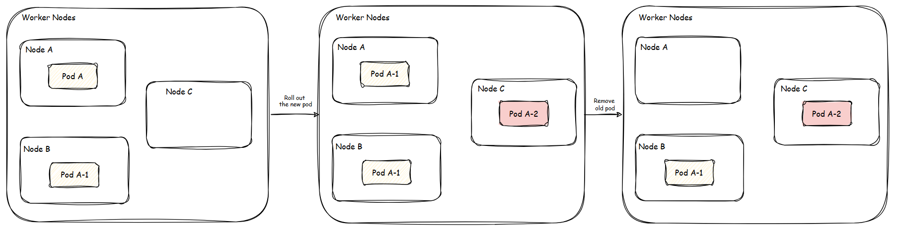
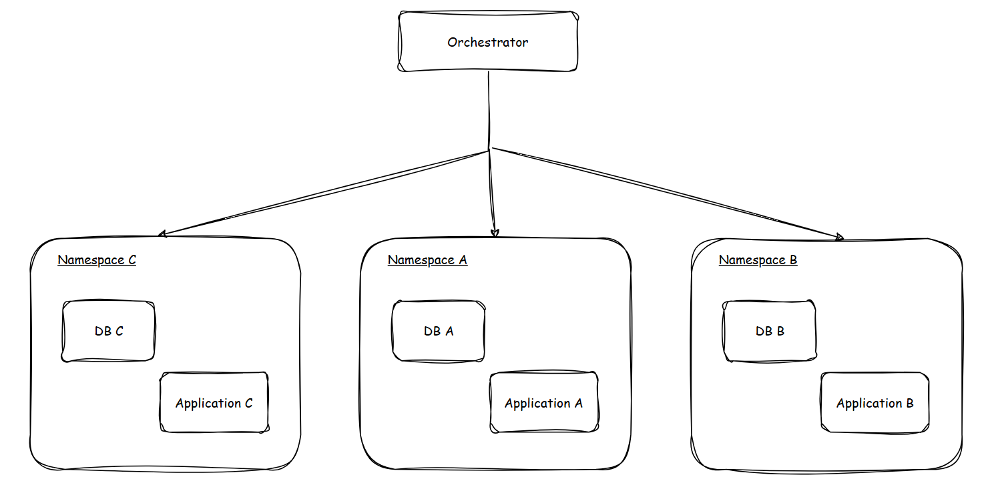
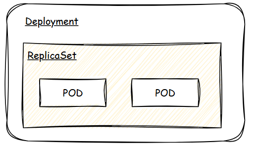
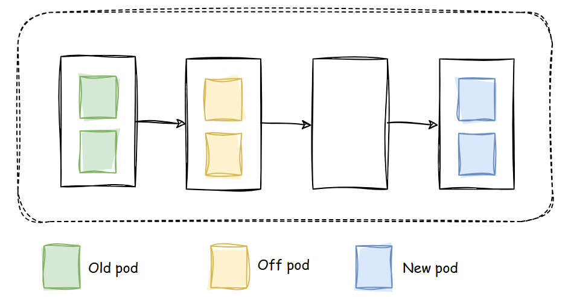
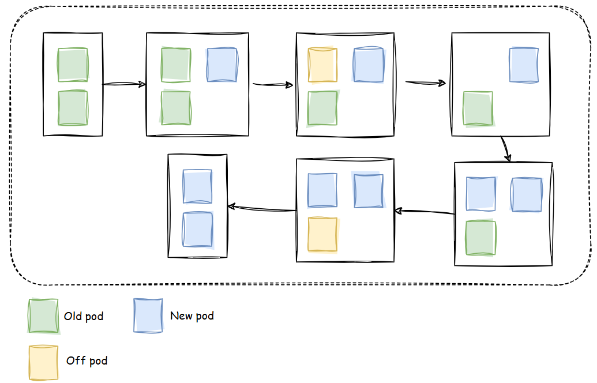
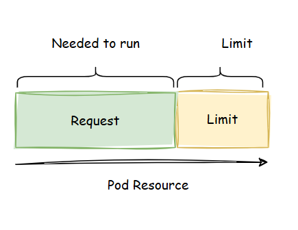
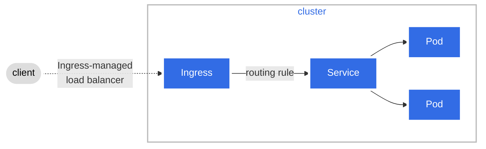
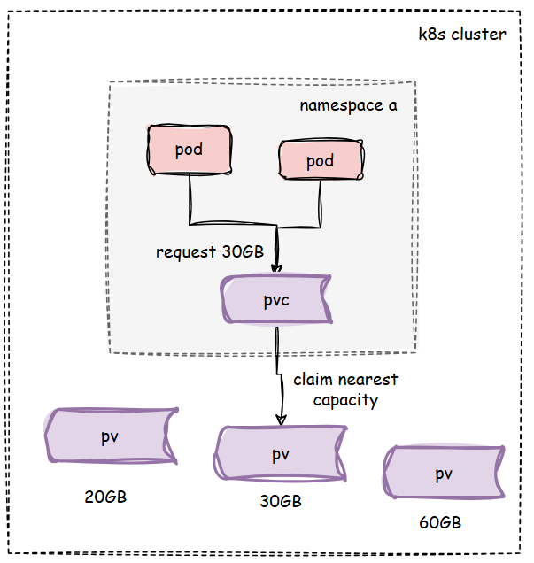

# Table of Contents
1. [Why Kubernetes?](#why-kubernetes)
    1. [Scale](#scale)
        1. [Auto Scaling](#auto-scaling)
        2. [High Availability](#high-availability)

2. [What is Kubernetes?](#what-is-kubernetes)
   - [Kubernetes Components](#kubernetes-components)
3. [Primary Kubernetes Objects](#primary-kubernetes-objects)
    - [Deployment](#deployment)
    - [StatefulSets](#statefulsets)
    - [DaemonSet](#daemonset)
    - [Probes](#probes)
    - [Deployment Strategy](#deployment-strategy)
    - [Resource Request & Limit](#deployment-strategy)
    - [Cronjob](#cronjob)
    - [Network - Service](#network---service)
    - [Network - Ingress](#network---ingress)
    - [Config - ConfigMap](#config---configmap)
    - [Config - Secret](#config---secret)
    - [Persistent Storage, Volume, Volume Claim](#config---secret)
4. [Dictionary](#dictionary)


# Why Kubernetes?

## Scale
### Auto Scaling
#### HPA (Horizontal Pod Auto scale)
  
- Minimal downtime
#### VPA (Vertical Pod Auto scale)
  
- Potentially require downtime

### High Availability
#### Zero downtime
Deployment Strategy: Rolling Update, Recreate.


#### Auto Healing Capability
Detect failure and recover application.

#### Kubernetes APIs
Provide metrics and functions to integrate with 3rd tools.

---

# What is Kubernetes?
Kubernetes is **Container Orchestrator**.
Dividing resource by group called **namespace** (database, application, etc.), they are **isolated**.


## Kubernetes Components


### Control Plane (master)
#### kube-scheduler
> Looks for Pods not yet bound to a node, and assigns each Pod to a suitable node.

When we deploy a **pod**, **kube-scheduler** will consider which **node** should 
we allocated the pod to (based on our needs).

#### etcd

> Consistent and highly-available key value store for all API server data.

After allocating pod to suitable node. **etcd** will help to manage **pod** data (resource, etc.).

#### kube-controller-manager
> Runs controllers to implement Kubernetes API behavior.

Manage application health.


### Node (worker)
#### kubelet
> Ensures that Pods are running, including their containers.

#### kube-proxy (optional)
> Maintains network rules on nodes to implement Services.

---
# Primary Kubernetes Objects
## Deployment
- A declarative template for pods, and replicaSet.
- Used for stateless application.
```yml
apiVersion: apps/v1
kind: Deployment
metadata:
  name: nginx-deployment
  labels:
    app: nginx
spec:
  replicas: 2
  selector:
    matchLabels:
      app: nginx
  template:
    metadata:
      labels:
        app: nginx
    spec:
      containers:
      - name: nginx
        image: nginx:1.14.2
        ports:
        - containerPort: 80
```



## StatefulSets
> A StatefulSet runs a group of Pods, and maintains a sticky identity for each of those Pods. This is useful for managing applications that need persistent storage or a stable, unique network identity.

Similar to **Deployment**, but **StatefulSets** manages stateful applications.

> StatefulSets are valuable for applications that require one or more of the following.
> - Stable, unique network identifiers.
> - Stable, persistent storage.
> - Ordered, graceful deployment and scaling.
> - Ordered, automated rolling updates.

There are 3 properties that can be updated on the fly:
- replicas
- template
- updateStrategy

**Example:**
We have this config.
```yml
apiVersion: apps/v1
kind: StatefulSet
metadata:
  name: postgres-sts
spec:
  replicas: 3
  template:
    metadata:
      labels:
        app: postgres
    spec:
      containers:
        - name: postgresql
          image: postgres:latest
          imagePullPolicy: IfNotPresent
          env:
            - name: POSTGRES_USER
              value: "postgres"
            - name: POSTGRES_PASSWORD
              valueFrom:
                secretKeyRef:
                  name: postgres-secrets
                  key: postgresql-password
            - name: POSTGRES_DB
              value: "postgres"
          ports:
            - name: postgresql
              containerPort: 5432
              protocol: TCP
          volumeMounts:
            - name: data-vct
              mountPath: /var/lib/postgresql/data
```
With above, we will have:

**1. Order pod creation/deletion:**
With `replicas: 3`, it will create by normal order `postgres-sts-0`, `postgres-sts-1`, `postgres-sts-3`. And delete on reverse order. 

**2. Persistent Storage:**

All replicas will use the same volume.

**3. Consistency for Stateful Applications:**

All replicas will use the same configuration.

**4. Scaling:**

Scale the `PostgreSQL` database horizontally.

## DaemonSet
>A DaemonSet defines Pods that provide node-local facilities. These might be fundamental to the operation of your cluster, such as a networking helper tool, or be part of an add-on.

> Some typical uses of a DaemonSet are:
>- running a cluster storage daemon on every node
>- running a logs collection daemon on every node
>- running a node monitoring daemon on every node

Similar to **Deployment** but:
- Every node has one pod (master & worker).
- Each pod lifetime depends on its node.

Use cases:
- Install a monitoring agent per node
- Install a log connector on each node.

## Probes

Probes are health checks that can **monitor a container's status** and act on it.
### StartupProbes: 
Indicate when the pod is ready.

**Example:**

My application as a healthcheck API `GET: /healthcheck` (see `path`).

I want to do a healthcheck in 5s after the instance starting, try 3 times, wait for 10s 
before next try.
```yml
apiVersion: v1
kind: Pod
metadata:
  name: nginx
spec:
  containers:
    - name: nginx
      image: nginx:1.14.2
      ports:
        - containerPort: 80
      livenessProbe:
        httpGet:
          path: /healthcheck # health endpoint
          port: 80
        initialDelaySeconds: 5 # 5s after the instance starting
        timeoutSeconds: 1 # timeout for each try
        periodSeconds: 10 # wait for next try
        successThreshold: 1
        failureThreshold: 3 # num of tries
```

### ReadinessProbes

Indicate when to start serving

### LivenessProbes

Indicate when to restart the pod.

## Deployment Strategy

### Recreate
Terminate all old version pods, then create new version pods.




**Use case:** Our business not allow to have 2 different version of 
applications running (e.g. huge update in application, etc.).

**Pros:** Quick update.

**Cons:** Downtime.

### Rolling update
Create a few new pods, then terminate old ones correspondingly.



**Use case:** Our business allow to have 2 different version of
applications running.

**Pros:** No downtime.

**Cons:** there is some period when the old and new application run at the same time.

## Resource Request & Limit

There are 2 main types of resources: CPU & Memory.

**Resource Request:** needed resource for a pod, 
k8s will ensure that when pod starts server will have enough resource for it.

**Resource Limit:** limit resource for a pod



## Cronjob

A job to automatically trigger an action in a scheduled time.

**Example:**

Our application usually have high traffic att 02:00 PM, so I want to create more pods
at 01:00 PM

```yml
apiVersion: batch/v1
kind: CronJob
metadata:
  name: scale-up-application
spec:
  schedule: "0 13 * * *"
  jobTemplate:
    spec:
      template:
        spec:
          containers:
            - name: scale-up
              image: bitnami/kubectl:latest
              command:
                - /bin/sh
                - -c
                - |
                  kubectl scale deployment <deployment-name> --replicas=10
          restartPolicy: OnFailure
```

## Network - Service
> Expose an application running in your cluster behind a single outward-facing endpoint, even when the workload is split across multiple backends.

> You use a Service to make that set of Pods available on the network so that clients can interact with it.

**Service** helps our pods available on internet for customer.
- Enable network access to pods.
- Load balancing.

**Types:**
- **ClusterIP**: provide internal access inside cluster.
- **NodePort**:
  - Provide a unique fixed cluster node port for external access.
  - Not recommended due to security.

**Example:**

Suppose that we have already created a pod with label `app.kubernetes.io/name: MyApp.
Below is how we expose that pod to internet.

Traffic sent to port `80` will be forwarded to port `9376`.

```yml
apiVersion: v1
kind: Service
metadata:
  name: my-service
spec:
  selector:
    app.kubernetes.io/name: MyApp
  ports:
    - protocol: TCP
      port: 80
      targetPort: 9376
```

## Network - Ingress
> Make your HTTP (or HTTPS) network service available using a protocol-aware configuration mechanism, that understands web concepts like URIs, hostnames, paths, and more. The Ingress concept lets you map traffic to different backends based on rules you define via the Kubernetes API.
> Ingress exposes HTTP and HTTPS routes from outside the cluster to services within the cluster. Traffic routing is controlled by rules defined on the Ingress resource.

Higher level than **Network - Service**, it's used to routing request to suitable pod.



## Config - ConfigMap
>A ConfigMap is an API object used to store non-confidential data in key-value pairs. Pods can consume ConfigMaps as environment variables, command-line arguments, or as configuration files in a volume.

Use for store configuration data:
- Key-value data.
- Manage pod configuration data
    - Environment variables.
    - Configuration files.
- Use for non-sensitive data.

**Example:**
```yml
apiVersion: v1
kind: ConfigMap
metadata:
  name: game-demo
data:
  # property-like keys; each key maps to a simple value
  player_initial_lives: "3"
  ui_properties_file_name: "user-interface.properties"

  # file-like keys
  game.properties: |
    enemy.types=aliens,monsters
    player.maximum-lives=5    
  user-interface.properties: |
    color.good=purple
    color.bad=yellow
    allow.textmode=true
---
apiVersion: v1
kind: Pod
metadata:
  name: configmap-demo-pod
spec:
  containers:
    - name: demo
      image: alpine
      command: ["sleep", "3600"]
      env:
        # Define the environment variable
        - name: PLAYER_INITIAL_LIVES # Notice that the case is different here
          # from the key name in the ConfigMap.
          valueFrom:
            configMapKeyRef:
              name: game-demo           # The ConfigMap this value comes from.
              key: player_initial_lives # The key to fetch.
        - name: UI_PROPERTIES_FILE_NAME
          valueFrom:
            configMapKeyRef:
              name: game-demo
              key: ui_properties_file_name
      volumeMounts:
        - name: config
          mountPath: "/config"
          readOnly: true
  volumes:
    # You set volumes at the Pod level, then mount them into containers inside that Pod
    - name: config
      configMap:
        # Provide the name of the ConfigMap you want to mount.
        name: game-demo
        # An array of keys from the ConfigMap to create as files
        items:
          - key: "game.properties"
            path: "game.properties"
          - key: "user-interface.properties"
            path: "user-interface.properties"
```

## Config - Secret
> A Secret is an object that contains a small amount of sensitive data such as a password, a token, or a key. Such information might otherwise be put in a Pod specification or in a container image. Using a Secret means that you don't need to include confidential data in your application code.

The idea is same as **ConfigMap** but this is more secure.

**Example:**
```yml
apiVersion: v1
kind: Secret
metadata:
  name: dotfile-secret
data:
  .secret-file: dmFsdWUtMg0KDQo=
---
apiVersion: v1
kind: Pod
metadata:
  name: secret-dotfiles-pod
spec:
  volumes:
    - name: secret-volume
      secret:
        secretName: dotfile-secret
  containers:
    - name: dotfile-test-container
      image: registry.k8s.io/busybox
      command:
        - ls
        - "-l"
        - "/etc/secret-volume"
      volumeMounts:
        - name: secret-volume
          readOnly: true
          mountPath: "/etc/secret-volume"
```

## Persistent Storage, Volume, Volume Claim

#### Persistent Volume:
- Static storage allocated in a cluster.
- Independent to pod's lifecycle.
- Provide by cluster admin.

#### Persistent Volume Claim:
- Static storage request.
- Independent to pod's lifecycle.
- Asked bt pods.

#### Scenario

```yml
apiVersion: v1
kind: PersistentVolume
metadata:
  name: pv-20gb
spec:
  capacity:
    storage: 20Gi
  accessModes:
    - ReadWriteOnce
  hostPath:
    path: /mnt/data1

---
apiVersion: v1
kind: PersistentVolume
metadata:
  name: pv-30gb
spec:
  capacity:
    storage: 30Gi
  accessModes:
    - ReadWriteOnce
  hostPath:
    path: /mnt/data2

---
apiVersion: v1
kind: PersistentVolume
metadata:
  name: pv-60gb
spec:
  capacity:
    storage: 60Gi
  accessModes:
    - ReadWriteOnce
  hostPath:
    path: /mnt/data3
---
apiVersion: v1
kind: PersistentVolumeClaim
metadata:
  name: my-pvc
  namespace: namespace-a
spec:
  accessModes:
    - ReadWriteOnce
  resources:
    requests:
      storage: 30Gi
---
apiVersion: v1
kind: Pod
metadata:
  name: my-pod
  namespace: namespace-a
spec:
  containers:
    - name: my-container
      image: busybox
      command:
        - sh
        - -c
        - "echo Hello Kubernetes! && sleep 3600"
      volumeMounts:
        - mountPath: /data
          name: my-storage
  volumes:
    - name: my-storage
      persistentVolumeClaim:
        claimName: my-pvc
```

---
# Dictionary
- Pod: represent for our applications.
- Node: // TODO

# Question:

1. Handle Exceeding Limits? What happens if we are not aware of it?


