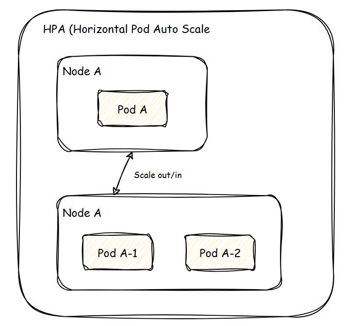
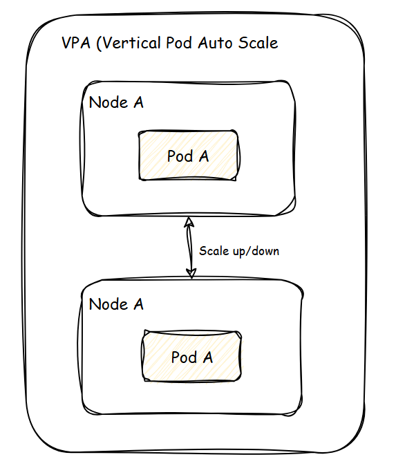
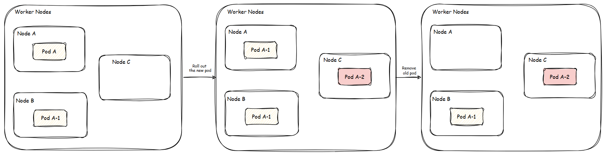
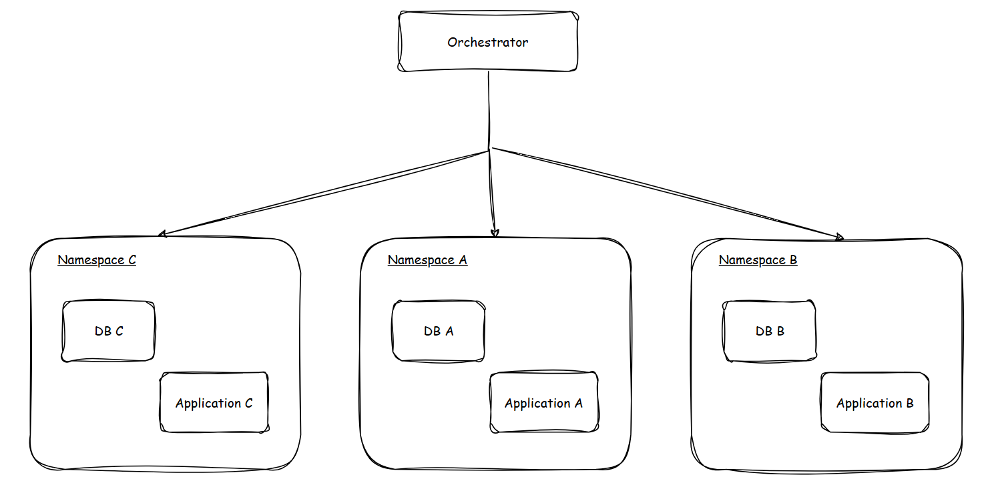
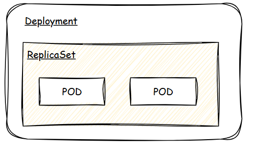

# Table of Contents
1. [Why Kubernetes?](#why-kubernetes)
    1. [Scale](#scale)
        1. [Auto Scaling](#auto-scaling)
            1. [HPA (Horizontal Pod Auto scale)](#hpa-horizontal-pod-auto-scale)
            2. [VPA (Vertical Pod Auto scale)](#vpa-vertical-pod-auto-scale)
        2. [High Availability](#high-availability)
            1. [Zero downtime](#zero-downtime)
            2. [Auto Healing Capability](#auto-healing-capability)
            3. [Kubernetes APIs](#kubernetes-apis)

2. [What is Kubernetes?](#what-is-kubernetes)
    1. [Kubernetes Components](#kubernetes-components)
        1. [Control Plane (master)](#control-plane-master)
            1. [kube-scheduler](#kube-scheduler)
            2. [etcd](#etcd)
            3. [kube-controller-manager](#kube-controller-manager)
        2. [Node (worker)](#node-worker)
            1. [kubelet](#kubelet)
            2. [kube-proxy (optional)](#kube-proxy-optional)

3. [Primary Kubernetes Objects](#primary-kubernetes-objects)
    1. [Deployment](#deployment)
    2. [StatefulSets](#statefulsets)
    3. [DaemonSet](#daemonset)
4. [Dictionary](#dictionary)


# Why Kubernetes?

## Scale
### Auto Scaling
#### HPA (Horizontal Pod Auto scale)
  
- Minimal downtime
#### VPA (Vertical Pod Auto scale)
  
- Potentially require downtime

### High Availability
#### Zero downtime
Deployment Strategy: Rolling Update, Recreate.


#### Auto Healing Capability
Detect failure and recover application.

#### Kubernetes APIs
Provide metrics and functions to integrate with 3rd tools.

---

# What is Kubernetes?
Kubernetes is **Container Orchestrator**.
Dividing resource by group called **namespace** (database, application, etc.), they are **isolated**.


## Kubernetes Components


### Control Plane (master)
#### kube-scheduler
> Looks for Pods not yet bound to a node, and assigns each Pod to a suitable node.

When we deploy a **pod**, **kube-scheduler** will consider which **node** should 
we allocated the pod to (based on our needs).

#### etcd

> Consistent and highly-available key value store for all API server data.

After allocating pod to suitable node. **etcd** will help to manage **pod** data (resource, etc.).

#### kube-controller-manager
> Runs controllers to implement Kubernetes API behavior.

Manage application health.


### Node (worker)
#### kubelet
> Ensures that Pods are running, including their containers.

#### kube-proxy (optional)
> Maintains network rules on nodes to implement Services.

---
# Primary Kubernetes Objects
## Deployment
- A declarative template for pods, and replicaSet.
- Used for stateless application.
```yml
apiVersion: apps/v1
kind: Deployment
metadata:
  name: nginx-deployment
  labels:
    app: nginx
spec:
  replicas: 2
  selector:
    matchLabels:
      app: nginx
  template:
    metadata:
      labels:
        app: nginx
    spec:
      containers:
      - name: nginx
        image: nginx:1.14.2
        ports:
        - containerPort: 80
```



## StatefulSets
> A StatefulSet runs a group of Pods, and maintains a sticky identity for each of those Pods. This is useful for managing applications that need persistent storage or a stable, unique network identity.

Similar to **Deployment**, but **StatefulSets** manages stateful applications.

> StatefulSets are valuable for applications that require one or more of the following.
> - Stable, unique network identifiers.
> - Stable, persistent storage.
> - Ordered, graceful deployment and scaling.
> - Ordered, automated rolling updates.

There are 3 properties that can be updated on the fly:
- replicas
- template
- updateStrategy

**Example:**
We have this config.
```yml
apiVersion: apps/v1
kind: StatefulSet
metadata:
  name: postgres-sts
spec:
  replicas: 3
  template:
    metadata:
      labels:
        app: postgres
    spec:
      containers:
        - name: postgresql
          image: postgres:latest
          imagePullPolicy: IfNotPresent
          env:
            - name: POSTGRES_USER
              value: "postgres"
            - name: POSTGRES_PASSWORD
              valueFrom:
                secretKeyRef:
                  name: postgres-secrets
                  key: postgresql-password
            - name: POSTGRES_DB
              value: "postgres"
          ports:
            - name: postgresql
              containerPort: 5432
              protocol: TCP
          volumeMounts:
            - name: data-vct
              mountPath: /var/lib/postgresql/data
```
With above, we will have:

**1. Order pod creation/deletion:**
With `replicas: 3`, it will create by normal order `postgres-sts-0`, `postgres-sts-1`, `postgres-sts-3`. And delete on reverse order. 

**2. Persistent Storage:**

All replicas will use the same volume.

**3. Consistency for Stateful Applications:**

All replicas will use the same configuration.

**4. Scaling:**

Scale the `PostgreSQL` database horizontally.

## DaemonSet
Similar to **Deployment** 

---
# Dictionary
- Pod: represent for our applications.
- Node: // TODO


