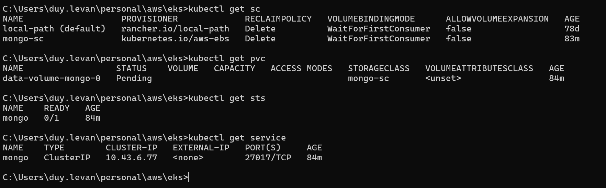

# Kubernetes Hands-on

Use for local development only.

This example will demonstrate the way we start an application with k8s at local.

## Prerequisites:
- [kubectl](https://docs.aws.amazon.com/eks/latest/userguide/install-kubectl.html)
- [RancherDesktop](https://rancherdesktop.io/)

Create an application consist of:
- 1 database: mongodb
- 1 frontend
- 1 backend

## Kubernetes setup
Create namespace
```bash
# create a new namespace called “eks-ns” if it is not yet present:
kubectl create ns eks-ns

# Change default working namespace to that one
kubectl config set-context --current --namespace eks-ns

# verify if you’ve set to this namespace:
kubectl config view --minify | grep namespace
kubectl config view --minify | findstr namespace # For Window
```

## Create database

**_mongodb.yml_**
```yml
---
---
apiVersion: storage.k8s.io/v1
kind: StorageClass
metadata:
  name: local-path
provisioner: rancher.io/local-path
volumeBindingMode: WaitForFirstConsumer
---
apiVersion: v1
kind: Service
metadata:
  name: mongo
  labels:
    name: mongo
spec:
  selector:
    name: mongo
  ports:
    - port: 27017
      protocol: TCP
      targetPort: 27017
---
apiVersion: v1
kind: ConfigMap
metadata:
  name: mongo-config
data:
  MONGODB_INITDB_ROOT_USERNAME: "user"
---
apiVersion: v1
kind: Secret
metadata:
  name: mongo-secrets
type: Opaque
data:
  MONGODB_INITDB_ROOT_PASSWORD: cGFzc3dvcmQK
---
apiVersion: apps/v1
kind: StatefulSet
metadata:
  name: mongo
spec:
  selector:
    matchLabels:
      name: mongo
  serviceName: "mongo"
  replicas: 1
  template:
    metadata:
      labels:
        name: mongo
    spec:
      terminationGracePeriodSeconds: 10
      containers:
        - name: mongo
          image: mongo
          ports:
            - containerPort: 27017
          envFrom:
            - configMapRef:
                name: mongo-config
            - secretRef:
                name: mongo-secrets
          volumeMounts:
            - name: data-volume
              mountPath: /data/db
  volumeClaimTemplates:
    - metadata:
        name: data-volume
      spec:
        storageClassName: local-path
        accessModes:
          - "ReadWriteOnce"
        resources:
          requests:
            storage: "1Gi"
```
---

With above file, we will set up mongodb instance on 
kubernetes, then verify it with below commands.

**Create database**
```bash
kubectl apply -f mongodb.yaml
```

**Verify storage class**
```bash
kubectl get sc
```

**Verify pvc**
```bash
kubectl get pvc
```

**Verify StatefulSet**
```bash
kubectl get sts
```

**Verify database service**
```bash
kubectl get service
```


**Verify ConfigMap**
```bash
kubectl get configmap

# check configmap details
kubectl describe configmap mongo-config
```

**Verify Secret**
```bash
kubectl get secret

# check secret details
kubectl get secret mongo-secrets -o yaml
```

**Make it run in your local**

Exposed front-end port.

```bash
kubectl port-forward service/frontend 3000:3000
```

---